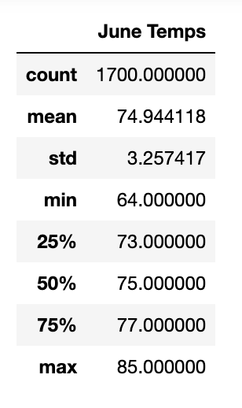
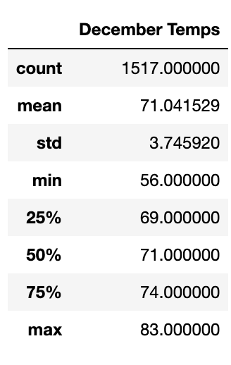

# Surfs up

###### A programmatic approach to weather analysis using SQLAlchemy and Python

## Overview

 A new prospect surfaced, to set up a *Surf n' Shake Shop* - a small and hopefully profitable business in Hawaii. The business intends to sell surfboards and ice cream to locals and tourists. 

With an investor on board, W. Avy, we are asked to look deeper into weather conditions in the prospective areas where the business is going to set up shop. We performed analysis on temperature and precipitation that recorded over a period of time, as compiled in the weather data that our investor provided, on the island of Oahu.

We are writing a report that describes the key differences in weather between June and December, and we are also going to be providing recommendations for further analysis.

## Results

### Programmatic Execution

We used Python language and Pandas on Jupyter Notebook to create an expedient programmatic structured approach, with simple and easy-to-use Python coding. Using SQLAlchemy, we were able query the SQLite dataset.

### Analysis

By performing analysis on what the weather looks like in June and in December in the island of Oahu, we found some key differences.

##### June Temperatures

Here is the screenshot of summary statistics we compiled about June temperatures:

##### December Temperatures

This is the screenshot of summary statistics we compiled about December temperatures:

These were the key differences that we found, on observing both summary statistics:

- The mean of the temperatures in June is higher than in December, but that number is only three degrees lower in December. Both means point to temperatures around the 70s.
- When we look at the first and third quartiles, we can spot the most significant difference between the two surveyed months: 
  - The first quartile in December is 69 degrees, whereas in June it is 73 degrees. 
  - The third quartile in December is 74 - lower than the median quartile in June, which is 75 degrees. June's third quartile reaches 77 degrees weather.
- The Standard Deviation is does not vary significantly between June and December.

## Summary

Considering our initial approach, which entails a closer look at temperature data on the key summer and winter months of June and December in the island of Oahu, we can infer that the weather is rather stable, with few oscillations that would impact the sustainability of a business that caters to local and tourist surfers year-round, making Oahu a good prospective island to house the up and coming *Surf n' Shake Shop* business.

Going forward, we are able to make key recommendations that would help further substantiating this discovery, regarding other weather factors. Alternately, an analysis that is thorough enough to include other weather factors can shed light on potential problems, which would be useful information for our investors, who would like to pinpoint the most profitable prospect for starting this business.

In order to get a more encompassing view of the weather data on the island of Oahu, we recommend the following analytics:

-  We could look at the weather oscillations in all four seasons. 
- Maintaining the focus in the months of June and December, there are two additional key points from which to analyze data that might be revealing in scoping out the prospects in the island of Oahu:
  - Analysis of the weather conditions in distinct surfing stations across the island.
  - Analysis of precipitation in those stations.

Using our programmatic approach as a template, further analysis can easily be aggregated. If we eventually conclude that the island of Oahu is not the most optimal prospect; we can obtain SQLite databases that are easy to query, that can show weather data on more surfing stations, over a wider scope of dates, and in reference to other islands. We should be able to analyze all additional databases, by refactoring our code.